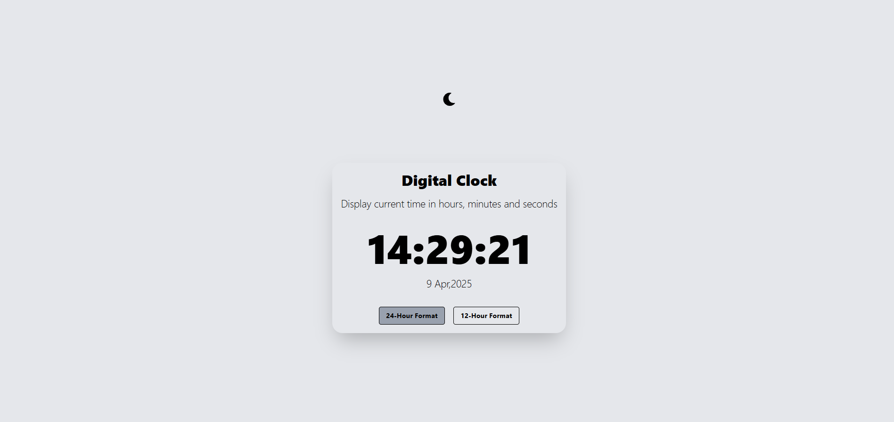
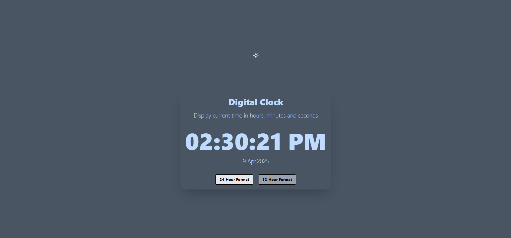

# React + Tailwind CSS Digital Clock Project

This is a simple and responsive digital clock application built using **React** and **Tailwind CSS**. The app displays the current time and date, with support for toggling between 12-hour and 24-hour formats. It also includes a dark mode feature for better user experience.

## Screenshots

Light Mode


Dark Mode


## Features

- **Real-Time Clock**: Displays the current time (hours, minutes, and seconds) and updates every second.
- **Date Display**: Shows the current day, month, and year.
- **Dark Mode**: Toggle between light and dark themes.
- **Hour Format Toggle**: Switch between 12-hour and 24-hour time formats.
- **Responsive Design**: Fully responsive and works on all screen sizes.

## Technologies Used

- **React**: For building the user interface.
- **Tailwind CSS**: For styling the application.
- **Vite**: For fast development and build tooling.

## Project Structure
```
├── src/
│   ├── components/
│   │   └── DigitalClock.jsx     # Main clock component
│   ├── styles/
│   │   └── index.css            # Tailwind CSS styles
│   ├── util/
│   │   └── DateTimeUtil.js      # Utility functions for formatting time and date
│   └── main.jsx                 # Entry point for the React app
├── index.html                   # HTML template
├── package.json                 # Project dependencies and scripts
├── vite.config.js               # Vite configuration
└── README.md                    # Project documentation
```

 ## Installation

1. Clone the repository:
   ```bash
   git clone https://github.com/gcintir/react-tailwindcss-projects.git
   cd react-tailwindcss-projects/digital-clock

2. Install dependencies
   ```bash
   npm install

3. Start the development server
   ```bash
   npm run dev

4. Open the app in your browser at http://localhost:5173